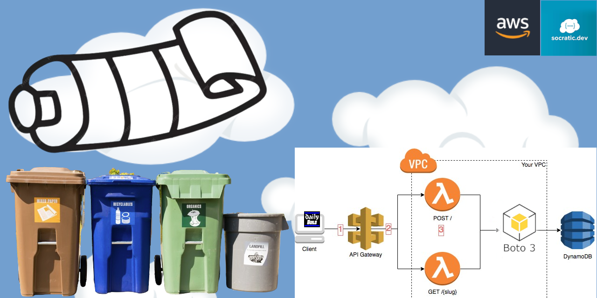

[](https://github.com/socraticDevBlog/pastebin/actions/workflows/pytest.yml)[](https://github.com/socraticDevBlog/pastebin/actions/workflows/lint.yml)
[](https://github.com/socraticDevBlog/pastebin/actions/workflows/terraform.yml)

# poor man cloud-native pastebin3



this project is about using AWS Free tier resources to host yourown pastebin

> A pastebin or text storage site is a type of online content-hosting service
> where users can store plain text (e.g. source code snippets for code review
> via Internet Relay Chat (IRC))

## swagger UI

[swagger UI pastebin http endpoints](https://socraticdevblog.github.io/pastebin/)

## Authors

- [@socraticDevBlog](https://www.github.com/socraticDevBlog)

## Run Locally

install `pipenv` for your user only

```bash
pip install --user pipenv

binarylocation=$(python -m site --user-base)/bin
# retrieve pipenv binary location in order to add it to PATH (suggested: add it to your .bashrc file)

export PATH=$PATH:"$binarylocation"
```

### 1. running app

Clone the project

```bash
  git clone git@github.com:socraticDevBlog/pastebin.git
```

Go to the project directory

```bash
  cd pastebin
```

Install dependencies

```bash
pipenv install --deploy --dev
```

### 2. Start DynamoDB local instance

you want to start a local database (DynamoDB) install locally and provision it
with a table named `paste`

```bash
 cd local

 docker compose up
```

#### got errors or want to start with a fresh database

remove running dynamodb container and start a fresh one

```bash
docker compose down -v

docker compose up
```

ℹ️ keep this terminal running in order to keep local DynamoDB Docker container running

### 3. Run Lambda locally

Using SAM (Serverless Application Model) CLI, you can easily execute the lambda
locally

We are using only one (1) lambda entrypoint to cover all http requests since
our use case is pretty simple.

Lambda code is located at `src/app.py`

Stubbed lambda _event_ input arguments are located at `local/events/`. There is
one file per http verb.

#### simulate a POST request locally

in a new terminal (the first one is busy running DynamoDB container)

```bash
pipenv run sam build && pipenv run sam local invoke -e local/events/post.json

# > Invoking app.lambda_handler (python3.9)
# Local image is up-to-date
# Using local image: public.ecr.aws/lambda/python:3.9-rapid-x86_64.

# Mounting /Users/me/git/pastebin/.aws-sam/build/PastebinFunction as /var/task:ro,delegated, inside runtime container
# START RequestId: 378e46ab-dd9b-4a31-bec7-1cc1b4a06ae8 Version: $LATEST
# END RequestId: 378e46ab-dd9b-4a31-bec7-1cc1b4a06ae8
# REPORT RequestId: 378e46ab-dd9b-4a31-bec7-1cc1b4a06ae8  Init Duration: 1.52 ms  Duration: 1021.66 ms    Billed Duration: 1022 ms        Memory Size: 128 MB     Max Memory Used: 128 MB
```

#### simulate a GET request locally

⚠️ make sure you have successfully inserted at least one(1) Paste in your local
database. Make sure `id` value in `local/events/get.json` file reflects this
inserted Paste's Id. 

for a simple API call, target `local/events/get-api.json` file

```bash
pipenv run sam build && pipenv run sam local invoke -e local/events/get.json
```

### 4. run API Gateway locally

sam CLI will detect the API Gateway and its available methods automatically
(GET, POST, etc.)

developer will use Postman app or VS Code Thunder Client to issue http request
toward `localhost:3000/paste` endpoint

```bash
pipenv run sam build && pipenv run sam local start-api

# Initializing the lambda functions containers.
# Local image is up-to-date
# Using local image: public.ecr.aws/lambda/python:3.9-rapid-x86_64.

# Mounting /Users/user/Documents/git/pastebin/.aws-sam/build/PastebinFunction as /var/task:ro,delegated, inside runtime container
# Containers Initialization is done.
# Mounting PastebinFunction at http://127.0.0.1:3000/paste [GET]
# You can now browse to the above endpoints to invoke your functions. You do not need to restart/reload SAM CLI while working on your functions, changes will be reflected instantly/automatically. If
# you used sam build before running local commands, you will need to re-run sam build for the changes to be picked up. You only need to restart SAM CLI if you update your AWS SAM template
# 2023-08-09 17:19:04 WARNING: This is a development server. Do not use it in a production deployment. Use a production WSGI server instead.
#  * Running on http://127.0.0.1:3000
# 2023-08-09 17:19:04 Press CTRL+C to quit
```

##### invoke local api /paste GET endpoint

```bash
id=<from previously posted paste>

curl http://127.0.0.1:3000/paste?id=$id
```

## Running Tests

To run tests, run the following command

```bash
pipenv run test
```

## deploying

We chose Terraform to deploy this app to AWS

### layers (installed python dependancies)

Python serverless functions often requires external dependencies as listed in
`Pipfile`

In AWS Lambda, we will add those dependencies as a `layer`. Our Terraform code
(see `terraform/main.tf` and analyse `resource "null_resource" "lambda_layer"`
to understand how we compress project's dependencies installed on local machine
by `pipenv`). There might be simpler ways to install Python dependencies to aws
lambda, but as of now(2023-12-23) we don't know better.

Make sure to package your dependencies in a zip file to add it as a layer to
our lambda -> https://spak.no/blog/article/63f47f130faeadeeeb968ae9

## use your pastebin on the public internet

### retrieve the endpoint URI

_assuming you have successfully deployed the app on aws using `terraform
apply`_ on your aws account

1. retrieve _api gateway_ endpoint using terraform command `terraform output`
   from key `api_gateway_endpoint`. it should look like an long URL (ex.:
   https://abc1234.execute-api.ca-central-1.amasonaws.com)
2. perform `POST` request to insert a new paste

```bash
curl -i  -X POST -H "Content-Type: application/json" -d '{"content":"one two tree testing my new api gateway/lambda integration"}' https://exj5m66tib.execute-api.ca-central-1.amazonaws.com/paste

```

3. perform a `GET` query over previous paste

```
 curl -i https://exj5m66tib.execute-api.ca-central-1.amazonaws.com/paste?id=<previous POST request response value>
```

## Roadmap

- [x] implement a DynamoDB CRUD client

- [x] safe-guard CI by automated unit tests suite (GitHub Action)

- [x] implement CI 'better practices' automated safe-guards

- [x] develop a lambda that will Create and Read pastes

- [x] implement an API Gateway that exposes Lamba's functions via http endpoint

- [x] deploy required infrastructure using Terraform in AWS

## Tech Stack

**dependencies management** pipenv

**database:** aws DynamoDB

**computing:** aws Lambda, python, boto3

**publicly available endpoint:** aws API Gateway

**CI/CD**: GitHub, GitHub Actions, pyenv, pytest

### local dev environment

- Docker
- DynamoDB local
- SAM (Lambda), awscli

### ADR

#### python dependencies are NOT pinned

In order to avoid having to upgrade project's dependencies when it's too late,
we're gonna upgrade dependencies to the latest version everytime we deploy

It might break our app after a deployment, but it's a price we're ready to pay
to have the app evolve with time with the latest dependencies
